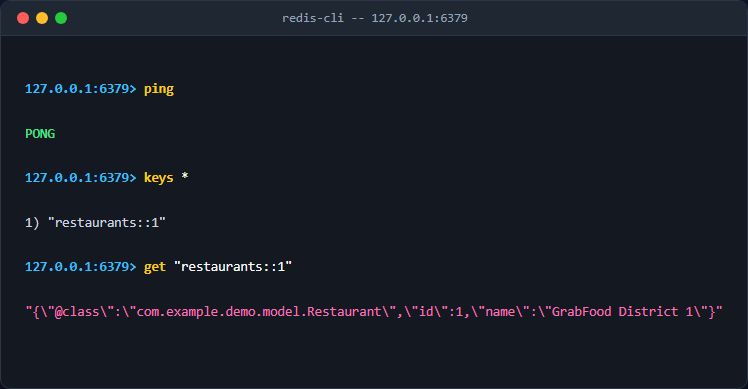

# Cấu hình Hạ tầng Distributed Cache chuyên nghiệp với Redis và Lettuce

## 1. Giới thiệu
Tài liệu này trình bày việc chuyển đổi từ Local Cache (Java Heap) sang Distributed Cache sử dụng Redis và Lettuce driver trong Spring Boot, phục vụ hệ thống GrabFood.

## 2. Kết quả kiểm tra Redis



## 3. Cấu hình ứng dụng
File `application.yml` được cấu hình thông số kết nối Redis:
```yaml
spring:
  data:
    redis:
      host: localhost
      port: 6379
      timeout: 2000ms
      lettuce:
        pool:
          max-active: 10
```